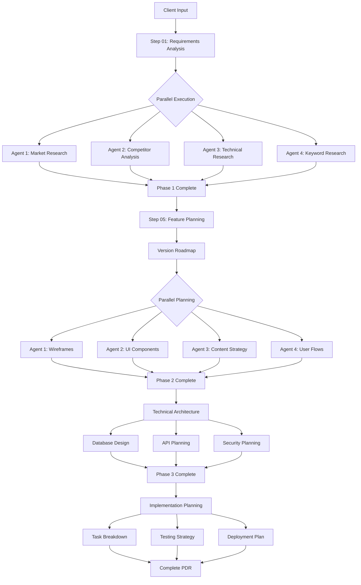

# PDR Cookbook Process Flow

## 🔄 Complete Automation Flow



## ⏱️ Timeline Breakdown

### Traditional Approach (2 weeks)
- Week 1: Discovery and research
- Week 2: Planning and documentation
- Human-intensive
- Sequential processing
- High cost

### PDR Cookbook Approach (4 hours)
```
Hour 1: Client analysis + parallel research launch
Hour 2: Research completion + planning start  
Hour 3: Planning completion + technical architecture
Hour 4: Implementation planning + final assembly
```

## 🎯 Version Progression

```
Day 1 (8 hrs) ─────► Landing Page
                     • Hero section
                     • Value prop
                     • Contact CTA
                     • Basic SEO
                     ↓
Day 2 (16 hrs) ────► MVP Site
                     • 5 core pages
                     • Navigation
                     • Contact form
                     • Responsive
                     ↓
Week 2 (80 hrs) ───► Full Launch
                     • All features
                     • Payments
                     • Email automation
                     • Analytics
                     ↓
Month 2 (320 hrs) ─► Growth Platform
                     • User accounts
                     • Advanced features
                     • A/B testing
                     • Optimizations
                     ↓
Year 2 (1000 hrs) ─► Market Leader
                     • AI features
                     • Multi-language
                     • API platform
                     • Mobile app
```

## 🔍 Quality Gates

```
┌─────────────────┐
│ Client Input    │ ──► Validate: Complete? Clear? Realistic?
└────────┬────────┘
         ↓
┌─────────────────┐
│ Research Phase  │ ──► Check: Recent data? 5+ competitors? Local insights?
└────────┬────────┘
         ↓
┌─────────────────┐
│ Planning Phase  │ ──► Verify: All pages covered? Features prioritized?
└────────┬────────┘
         ↓
┌─────────────────┐
│ Technical Phase │ ──► Confirm: Scalable? Secure? Performant?
└────────┬────────┘
         ↓
┌─────────────────┐
│ Final PDR       │ ──► Review: Actionable? Complete? Client-approved?
└─────────────────┘
```

## 🚀 Automation Triggers

### Auto-Progress Conditions
- ✅ All required files present
- ✅ JSON validation passes  
- ✅ No blocking errors
- ✅ Time limits not exceeded

### Manual Review Points
- 🔍 After competitor analysis
- 🔍 After feature planning
- 🔍 Before final delivery

## 📈 Scalability Model

### Single Project
- 1 Claude Code instance
- 4-hour completion
- Full PDR output

### Agency Scale (10 projects/week)
- Queue system for projects
- Parallel Claude Code instances
- 40 hours total capacity needed
- 10 comprehensive PDRs delivered

### Enterprise Scale (50+ projects/week)
- Dedicated infrastructure
- Template optimization
- Custom integrations
- Sub-2-hour PDRs possible

---

**The PDR Cookbook transforms weeks of discovery into hours of automated excellence.**