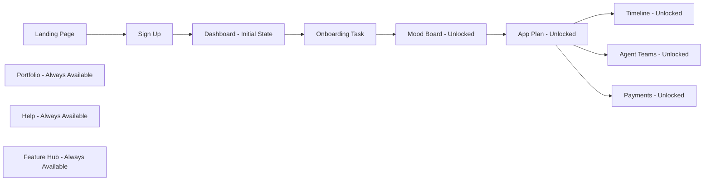
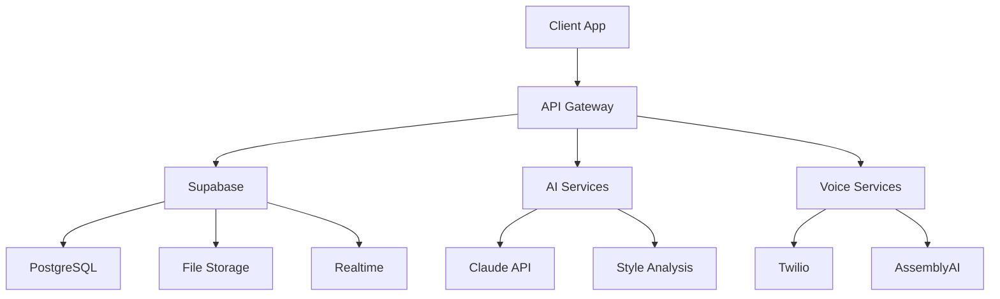

# SISO Agency PDR Feature Roadmap & Progressive Unlock System

## Executive Summary

This roadmap defines the progressive feature unlock system and development timeline for the SISO Agency Client Onboarding Platform. Based on competitor analysis showing gaps in progressive unlocking and design preference collection, we've designed a gamified, milestone-based system that guides clients through a structured journey while maintaining engagement and reducing overwhelm.

## Table of Contents

1. [Feature Progression Flow](#1-feature-progression-flow)
2. [Unlock Criteria & Requirements](#2-unlock-criteria--requirements)
3. [Feature Versions & Releases](#3-feature-versions--releases)
4. [Priority Matrix](#4-priority-matrix)
5. [Development Timeline](#5-development-timeline)
6. [Success Metrics](#6-success-metrics)
7. [Technical Dependencies](#7-technical-dependencies)

---

## 1. Feature Progression Flow

### 1.1 Core Journey Map



### 1.2 Detailed Feature States

#### **Phase 1: Initial Access** (0% Complete)
- **Available Features:**
  - Industry-specific landing pages
  - Sign up/Sign in
  - Basic dashboard with task list
  - Portfolio showcase
  - Help center
  - Feature hub

#### **Phase 2: Onboarding** (0-25% Complete)
- **Trigger:** User completes sign-up
- **Available Features:**
  - Chat-based onboarding
  - Voice call onboarding option
  - Progress saving
  - Company information collection
  - Social media integration

#### **Phase 3: Design Discovery** (25-50% Complete)
- **Trigger:** Onboarding task completed (minimum 80% data collected)
- **Unlocked Features:**
  - Mood Board Creator
  - Industry-specific templates
  - Image upload/selection
  - Style preference tagging
  - AI-powered style analysis

#### **Phase 4: Planning** (50-75% Complete)
- **Trigger:** Mood board submitted (minimum 5 images selected)
- **Unlocked Features:**
  - App Plan viewer
  - Feature selection
  - Feedback system
  - Plan acceptance workflow

#### **Phase 5: Full Access** (75-100% Complete)
- **Trigger:** App plan accepted
- **Unlocked Features:**
  - 46-step PDR Timeline
  - Agent Teams dashboard
  - Financial/Payments section
  - Real-time progress tracking
  - Direct messaging with agents

---

## 2. Unlock Criteria & Requirements

### 2.1 Progressive Unlock Logic

```typescript
interface UnlockCriteria {
  onboarding: {
    required: true,
    minimumCompletion: 80, // percentage
    requiredFields: [
      'companyName',
      'companyLogo',
      'businessDescription',
      'businessGoals'
    ],
    optionalFields: [
      'socialMediaLinks',
      'existingWebsite',
      'targetAudience'
    ],
    unlocks: ['moodBoard']
  },
  
  moodBoard: {
    required: true,
    minimumImages: 5,
    maximumImages: 20,
    requiresTags: true,
    requiresCategories: false, // optional
    unlocks: ['appPlan']
  },
  
  appPlan: {
    required: true,
    requiresReview: true,
    requiresAcceptance: true,
    feedbackOptional: true,
    unlocks: ['timeline', 'agentTeams', 'payments']
  }
}
```

### 2.2 Notification System for Unlocks

```typescript
interface UnlockNotification {
  id: string;
  type: 'feature_unlocked' | 'milestone_reached' | 'task_completed';
  title: string;
  message: string;
  icon: string;
  action?: {
    label: string;
    route: string;
  };
  celebrationType?: 'confetti' | 'badge' | 'animation';
}

// Example notifications
const notifications: UnlockNotification[] = [
  {
    id: 'mood_board_unlock',
    type: 'feature_unlocked',
    title: '🎨 Mood Board Unlocked!',
    message: 'Great job completing your profile! Now let\'s explore your design preferences.',
    icon: 'palette',
    action: {
      label: 'Create Mood Board',
      route: '/client/mood-board'
    },
    celebrationType: 'confetti'
  },
  {
    id: 'full_access',
    type: 'milestone_reached',
    title: '🚀 Full Dashboard Access!',
    message: 'Your project is now in production. Track progress in real-time!',
    icon: 'rocket',
    celebrationType: 'animation'
  }
];
```

### 2.3 Time-Based vs Task-Based Unlocks

| Feature | Unlock Type | Criteria | Fallback |
|---------|------------|----------|----------|
| Mood Board | Task-based | Complete onboarding | 24hr time unlock if 50% complete |
| App Plan | Task-based | Submit mood board | No time-based unlock |
| Timeline | Task-based | Accept app plan | No time-based unlock |
| Feature Hub Updates | Time-based | Weekly new features | Always available |
| Help Articles | Mixed | Contextual + always available | Progressive disclosure |

---

## 3. Feature Versions & Releases

### 3.1 MVP - Week 1 Launch
**Focus:** Core flow with essential features

#### Features Included:
1. **Landing Pages** (3 industries)
   - Restaurants
   - Bars
   - Agencies

2. **Authentication**
   - Email/password signup
   - Social login (Google)
   - Password reset

3. **Basic Dashboard**
   - Task list
   - Progress indicator
   - Welcome tutorial

4. **Chat Onboarding**
   - Text-based Q&A
   - Progress saving
   - Basic validation

5. **Simple Mood Board**
   - Grid view
   - Image upload
   - Basic selection
   - Submit functionality

6. **Static Pages**
   - Portfolio
   - Help center
   - Feature hub (read-only)

#### Technical Stack:
- React + TypeScript
- Supabase Auth & Database
- Existing UI components
- Basic PWA setup

### 3.2 Version 1.1 - Week 2 Enhancement
**Focus:** Enhanced UI/UX and expanded industries

#### New Features:
1. **Additional Industries** (5 more)
   - Car Rental
   - Barbershops
   - Fitness Centers
   - Retail Stores
   - Professional Services

2. **Voice Onboarding**
   - 2-minute voice call option
   - Transcription service
   - Auto-fill from voice data

3. **Enhanced Mood Board**
   - Swipe interface option
   - Industry templates
   - AI style suggestions
   - Color extraction

4. **Improved Dashboard**
   - Animated progress
   - Achievement badges
   - Milestone celebrations

5. **Mobile Optimizations**
   - Touch gestures
   - Offline capability
   - Install prompts

### 3.3 Version 1.5 - Month 1 Release
**Focus:** Full agent integration and advanced features

#### New Features:
1. **Live Timeline**
   - Real-time updates
   - Step-by-step visibility
   - Time estimates
   - Blocker alerts

2. **Agent Teams Dashboard**
   - Live agent activity
   - Token usage tracking
   - Time spent metrics
   - Direct messaging

3. **Financial Module**
   - Cost breakdown
   - Payment processing
   - Invoice generation
   - Budget tracking

4. **Advanced Mood Board**
   - AR preview
   - Video mood boards
   - Brand extraction
   - Style reports

5. **Feature Hub Interactivity**
   - Submit suggestions
   - Vote on features
   - Track implementation
   - Industry filtering

### 3.4 Version 2.0 - Month 2 Release
**Focus:** Analytics, optimization, and scale

#### New Features:
1. **Client Analytics**
   - Engagement metrics
   - Progress insights
   - Industry benchmarks
   - ROI calculations

2. **AI Enhancements**
   - Predictive timelines
   - Smart recommendations
   - Auto-categorization
   - Trend analysis

3. **Collaboration Tools**
   - Team invites
   - Shared workspaces
   - Comment threads
   - Approval workflows

4. **Export & Integration**
   - Notion sync
   - Figma export
   - Brand guidelines
   - API access

5. **White-Label Options**
   - Custom branding
   - Domain mapping
   - Theme customization
   - Agency dashboards

---

## 4. Priority Matrix

### 4.1 Must-Have Features (P0) - Launch Critical

| Feature | Complexity | Impact | Week |
|---------|------------|--------|------|
| User Authentication | Low | Critical | 1 |
| Basic Dashboard | Medium | Critical | 1 |
| Chat Onboarding | Medium | Critical | 1 |
| Simple Mood Board | High | Critical | 1 |
| Progress Tracking | Medium | High | 1 |
| Mobile Responsive | Medium | Critical | 1 |

### 4.2 Should-Have Features (P1) - Quick Wins

| Feature | Complexity | Impact | Week |
|---------|------------|--------|------|
| Voice Onboarding | High | High | 2 |
| Industry Templates | Medium | High | 2 |
| Achievement System | Low | Medium | 2 |
| PWA Features | Medium | High | 2 |
| Enhanced UI Polish | Low | Medium | 2 |

### 4.3 Nice-to-Have Features (P2) - Differentiation

| Feature | Complexity | Impact | Week |
|---------|------------|--------|------|
| AI Style Analysis | High | Medium | 3 |
| AR Preview | Very High | Low | 4 |
| Video Mood Boards | High | Low | 4 |
| Advanced Analytics | High | Medium | 4 |
| White-Label | Very High | Medium | 8 |

### 4.4 Future Considerations (P3) - Long Term

| Feature | Complexity | Impact | Quarter |
|---------|------------|---------|---------|
| Native Mobile Apps | Very High | Medium | Q2 |
| Enterprise Features | High | High | Q2 |
| AI Chatbot Support | High | Medium | Q2 |
| Marketplace | Very High | High | Q3 |
| Multi-language | Medium | Medium | Q3 |

---

## 5. Development Timeline

### 5.1 Sprint Breakdown

#### Sprint 1 (Days 1-5): Foundation
**Frontend Team:**
- Set up project structure
- Implement authentication flow
- Create landing pages (3 industries)
- Build basic dashboard

**Backend Team:**
- Database schema setup
- Auth configuration
- API endpoints for onboarding
- File storage setup

**Design Team:**
- Finalize UI mockups
- Create industry templates
- Design unlock animations
- Mobile UI adaptations

#### Sprint 2 (Days 6-10): Core Features
**Frontend Team:**
- Chat onboarding interface
- Mood board grid view
- Progress tracking UI
- Navigation system

**Backend Team:**
- Onboarding data models
- Mood board storage
- Progress tracking logic
- Real-time subscriptions

**QA Team:**
- Test authentication flows
- Mobile responsiveness
- Cross-browser testing
- Performance benchmarks

#### Sprint 3 (Days 11-15): Enhancements
**Frontend Team:**
- Voice onboarding UI
- Swipe interface
- Achievement system
- PWA configuration

**Backend Team:**
- Voice transcription integration
- AI style analysis API
- Notification system
- Analytics tracking

**DevOps Team:**
- CI/CD pipeline
- Staging environment
- Monitoring setup
- Backup strategies

#### Sprint 4 (Days 16-20): Integration
**Full Team:**
- Agent system integration
- Timeline implementation
- Payment module
- End-to-end testing
- Performance optimization
- Documentation

### 5.2 Resource Allocation

```yaml
team_allocation:
  frontend:
    - senior_dev: 100%
    - mid_dev: 100%
    - junior_dev: 50%
  
  backend:
    - senior_dev: 100%
    - mid_dev: 100%
  
  design:
    - ui_designer: 75%
    - ux_researcher: 25%
  
  qa:
    - test_engineer: 100%
    - automation_engineer: 50%
  
  devops:
    - engineer: 50%
  
  product:
    - product_manager: 100%
    - project_manager: 50%
```

### 5.3 Dependencies & Blockers

#### Critical Dependencies:
1. **Supabase Setup** - Must be complete before Sprint 1
2. **UI Component Library** - Already available ✓
3. **Industry Content** - Needed by Sprint 2
4. **AI API Keys** - Required for style analysis
5. **Payment Gateway** - Needed by Sprint 4

#### Potential Blockers:
1. **Voice API Limits** - May need fallback option
2. **Image Storage Costs** - Monitor usage closely
3. **Real-time Scalability** - Load test early
4. **Mobile Performance** - Continuous optimization
5. **Industry Compliance** - Legal review needed

---

## 6. Success Metrics

### 6.1 Launch Metrics (Week 1)

| Metric | Target | Measurement |
|--------|--------|-------------|
| Sign-up Conversion | 15% | Landing → Account |
| Onboarding Completion | 80% | Start → Finish |
| Mood Board Creation | 60% | Unlocked → Created |
| Time to First Value | <10 min | Sign-up → Mood Board |
| Mobile Usage | 70% | Device analytics |

### 6.2 Growth Metrics (Month 1)

| Metric | Target | Measurement |
|--------|--------|-------------|
| Weekly Active Users | 1000 | Unique logins |
| Feature Adoption | 50% | Each unlocked feature |
| Client Satisfaction | 4.5/5 | NPS surveys |
| Support Tickets | <5% | Per active user |
| Project Starts | 200 | Accepted app plans |

### 6.3 Business Metrics (Quarter 1)

| Metric | Target | Measurement |
|--------|--------|-------------|
| Revenue | $50K MRR | Subscription + projects |
| Client Retention | 90% | Month-over-month |
| Agent Efficiency | 2x | Projects per agent |
| Platform Uptime | 99.9% | Monitoring tools |
| Cost per Acquisition | <$100 | Marketing spend / signups |

### 6.4 Engagement Metrics

```typescript
interface EngagementMetrics {
  daily: {
    avgSessionDuration: number; // Target: 15 min
    featuresUsedPerSession: number; // Target: 3+
    returningUsers: number; // Target: 60%
  };
  
  weekly: {
    progressMade: number; // Target: 25% per week
    moodBoardsCreated: number; // Target: 2 per user
    feedbackSubmitted: number; // Target: 30% of users
  };
  
  feature_specific: {
    moodBoard: {
      avgImagesSelected: number; // Target: 8-12
      completionRate: number; // Target: 85%
      timeSpent: number; // Target: 5-10 min
    };
    
    featureHub: {
      suggestionsSubmitted: number; // Target: 10/week
      votescast: number; // Target: 50/week
      engagementRate: number; // Target: 40%
    };
  };
}
```

---

## 7. Technical Dependencies

### 7.1 Infrastructure Requirements

```yaml
infrastructure:
  frontend:
    hosting: Vercel
    cdn: Cloudflare
    monitoring: Sentry
  
  backend:
    database: Supabase (PostgreSQL)
    auth: Supabase Auth
    storage: Supabase Storage
    functions: Supabase Edge Functions
  
  third_party:
    ai: Anthropic Claude API
    voice: Twilio Voice API
    transcription: AssemblyAI
    payments: Stripe
    analytics: PostHog
    email: SendGrid
```

### 7.2 Integration Architecture



### 7.3 Performance Requirements

| Component | Requirement | Target |
|-----------|------------|--------|
| Page Load | First Contentful Paint | <1.5s |
| API Response | 95th percentile | <200ms |
| Image Upload | Per image | <3s |
| Real-time Updates | Latency | <100ms |
| Mobile Performance | Lighthouse Score | >90 |

---

## Implementation Recommendations

### Phase 1: Foundation (Week 1)
1. **Focus on core flow** - Don't over-engineer
2. **Use existing components** - 200+ already built
3. **Mobile-first approach** - 70% users on mobile
4. **Quick wins** - Visible progress keeps clients engaged
5. **Monitor everything** - Data drives decisions

### Phase 2: Enhancement (Week 2)
1. **Polish UI/UX** - First impressions matter
2. **Add delight** - Animations and celebrations
3. **Expand content** - More industries and templates
4. **Optimize performance** - Speed is a feature
5. **Gather feedback** - Iterate based on usage

### Phase 3: Scale (Month 1+)
1. **Automate workflows** - Reduce manual work
2. **Enhance AI** - Smarter recommendations
3. **Build community** - Feature hub engagement
4. **Track ROI** - Prove value to clients
5. **Plan ahead** - Stay 2 sprints ahead

## Risk Mitigation

### Technical Risks:
1. **Scalability** - Load test early and often
2. **Security** - Regular audits and pen testing
3. **Performance** - Continuous monitoring
4. **Compatibility** - Test across devices
5. **Downtime** - Redundancy and backups

### Business Risks:
1. **Low adoption** - A/B test everything
2. **High churn** - Focus on time-to-value
3. **Support overload** - Self-service options
4. **Feature creep** - Stick to roadmap
5. **Competition** - Unique value proposition

## Conclusion

This roadmap provides a clear path from MVP to full-featured platform, with progressive unlocking that guides clients through their journey while maintaining engagement. The phased approach allows for quick market entry while building toward a comprehensive solution that addresses the gaps identified in competitor analysis.

Success depends on:
- Executing the core flow flawlessly
- Maintaining focus on client experience
- Leveraging existing infrastructure
- Iterating based on real usage data
- Building features clients actually want

By following this roadmap, SISO Agency can launch a differentiated client onboarding platform that stands out in the market through its progressive unlock system, design-focused approach, and transparent project tracking.