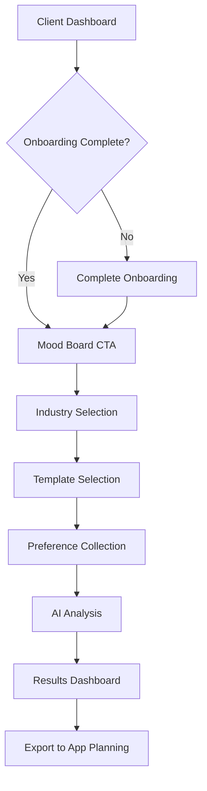

# Mood Board System Design Document
## SISO Agency PDR - Design Preference Collection Feature

## Executive Summary

The Mood Board System is a critical component of SISO Agency's PDR (Product Discovery & Research) platform, designed to capture client design preferences through an intuitive, mobile-first interface. This feature bridges the gap between initial client onboarding and the AI-powered app planning phase by collecting visual preferences that inform the entire design process.

## 1. System Architecture & Flow

### 1.1 Entry Points & User Journey



### 1.2 Core User Flow

1. **Dashboard Integration**
   - Prominent "Create Mood Board" card after onboarding
   - Progress indicator showing mood board as next step
   - Quick-start option for returning users

2. **Industry & Template Selection**
   - Industry picker with visual previews
   - Template recommendation based on business type
   - Option to start from scratch or use AI suggestions

3. **Preference Collection Methods**
   - Swipe interface (mobile primary)
   - Grid selection (desktop/tablet)
   - Upload custom inspiration
   - URL import from Pinterest/Dribbble
   - AI-generated suggestions

4. **Results & Export**
   - Visual summary of selections
   - Extracted design principles
   - Direct integration with app planning
   - Shareable link for team review

## 2. Data Collection Strategy

### 2.1 Preference Categories

```typescript
interface DesignPreferences {
  // Visual Style
  visualStyle: {
    overall: 'minimal' | 'bold' | 'playful' | 'professional' | 'artistic';
    complexity: 1 | 2 | 3 | 4 | 5; // 1=very simple, 5=very complex
    modernity: 1 | 2 | 3 | 4 | 5; // 1=classic, 5=cutting-edge
  };
  
  // Color Preferences
  colors: {
    primary: string[];
    secondary: string[];
    accent: string[];
    avoided: string[];
    scheme: 'monochromatic' | 'analogous' | 'complementary' | 'triadic' | 'custom';
    brightness: 'light' | 'dark' | 'both';
  };
  
  // Typography
  typography: {
    headerStyle: 'serif' | 'sans-serif' | 'display' | 'script';
    bodyStyle: 'serif' | 'sans-serif';
    readability: 1 | 2 | 3 | 4 | 5; // 1=decorative, 5=highly readable
    personality: string[]; // ['modern', 'classic', 'friendly', 'serious']
  };
  
  // Layout & Spacing
  layout: {
    density: 'spacious' | 'balanced' | 'compact';
    structure: 'grid' | 'asymmetric' | 'centered' | 'magazine';
    navigation: 'traditional' | 'minimal' | 'experimental';
  };
  
  // Imagery & Graphics
  imagery: {
    style: 'photography' | 'illustration' | 'abstract' | 'mixed';
    treatment: 'realistic' | 'stylized' | 'minimal';
    useOfIcons: 'heavy' | 'moderate' | 'minimal' | 'none';
    animations: 'none' | 'subtle' | 'moderate' | 'dynamic';
  };
  
  // Brand Personality
  personality: {
    traits: string[]; // Selected from predefined list
    emotions: string[]; // How users should feel
    avoidTraits: string[]; // What to avoid
  };
}
```

### 2.2 Scoring & Weighting System

```typescript
interface ScoringSystem {
  // Each swipe/selection contributes to scores
  swipeActions: {
    love: 3,      // Strong positive signal
    like: 2,      // Positive signal
    neutral: 0,   // Skip/unsure
    dislike: -2,  // Negative signal
    hate: -3      // Strong negative signal
  };
  
  // Confidence calculation
  calculateConfidence(selections: Selection[]): number {
    // More consistent selections = higher confidence
    // Formula: consistency * volume * explicitness
    return confidence; // 0-100%
  };
  
  // Preference strength
  preferenceStrength: {
    required: number;    // Must have (confidence > 80%)
    preferred: number;   // Should have (confidence 60-80%)
    neutral: number;     // No preference (confidence 40-60%)
    avoided: number;     // Should not have (confidence < 40%)
  };
}
```

### 2.3 Database Schema

```sql
-- Mood boards table
CREATE TABLE mood_boards (
  id UUID PRIMARY KEY DEFAULT uuid_generate_v4(),
  client_id UUID REFERENCES clients(id),
  project_id UUID REFERENCES projects(id),
  name VARCHAR(255) NOT NULL,
  industry VARCHAR(100),
  template_id UUID REFERENCES mood_board_templates(id),
  status VARCHAR(50) DEFAULT 'in_progress', -- in_progress, completed, archived
  preferences JSONB, -- Stores DesignPreferences object
  ai_analysis JSONB, -- AI-generated insights
  created_at TIMESTAMP DEFAULT NOW(),
  updated_at TIMESTAMP DEFAULT NOW(),
  completed_at TIMESTAMP
);

-- Mood board items (individual selections)
CREATE TABLE mood_board_items (
  id UUID PRIMARY KEY DEFAULT uuid_generate_v4(),
  mood_board_id UUID REFERENCES mood_boards(id) ON DELETE CASCADE,
  item_type VARCHAR(50), -- image, color, typography, layout
  source VARCHAR(50), -- uploaded, url, ai_generated, template
  url TEXT,
  metadata JSONB, -- Store extracted colors, tags, etc.
  user_action VARCHAR(20), -- love, like, neutral, dislike, hate
  notes TEXT,
  position INTEGER, -- For ordering
  created_at TIMESTAMP DEFAULT NOW()
);

-- Industry-specific templates
CREATE TABLE mood_board_templates (
  id UUID PRIMARY KEY DEFAULT uuid_generate_v4(),
  industry VARCHAR(100) NOT NULL,
  sub_category VARCHAR(100),
  name VARCHAR(255) NOT NULL,
  description TEXT,
  preview_images TEXT[], -- Array of preview URLs
  default_items JSONB, -- Pre-selected items for this template
  popularity INTEGER DEFAULT 0, -- Usage tracking
  created_at TIMESTAMP DEFAULT NOW()
);

-- Tracking and analytics
CREATE TABLE mood_board_analytics (
  id UUID PRIMARY KEY DEFAULT uuid_generate_v4(),
  mood_board_id UUID REFERENCES mood_boards(id),
  event_type VARCHAR(50), -- started, item_rated, completed, exported
  event_data JSONB,
  timestamp TIMESTAMP DEFAULT NOW()
);
```

## 3. User Interface Design

### 3.1 Mobile Swipe Interface (Primary)

```typescript
// Swipeable Mood Board Card Component
const MoodBoardCard = ({ item, onAction }) => {
  return (
    <motion.div
      drag="x"
      dragConstraints={{ left: -200, right: 200 }}
      onDragEnd={handleDragEnd}
      className="relative w-full h-[70vh] max-w-md mx-auto"
      style={{
        rotate: rotation,
        opacity: opacity
      }}
    >
      {/* Card Content */}
      <div className="relative h-full rounded-2xl overflow-hidden shadow-2xl">
        {/* Image/Content */}
        
        
        {/* Overlay Information */}
        <div className="absolute bottom-0 left-0 right-0 bg-gradient-to-t from-black/80 to-transparent p-6">
          <h3 className="text-white text-xl font-semibold">{item.title}</h3>
          <p className="text-white/80 text-sm mt-1">{item.category}</p>
          
          {/* Quick Tags */}
          <div className="flex flex-wrap gap-2 mt-3">
            {item.tags.map(tag => (
              <span className="px-2 py-1 bg-white/20 rounded-full text-xs text-white">
                {tag}
              </span>
            ))}
          </div>
        </div>
        
        {/* Swipe Indicators */}
        <div className="absolute top-1/2 -translate-y-1/2 left-4 opacity-0 transition-opacity"
             style={{ opacity: swipeDirection === 'left' ? 1 : 0 }}>
          <div className="bg-red-500 text-white p-3 rounded-full">
            <X className="w-6 h-6" />
          </div>
        </div>
        
        <div className="absolute top-1/2 -translate-y-1/2 right-4 opacity-0 transition-opacity"
             style={{ opacity: swipeDirection === 'right' ? 1 : 0 }}>
          <div className="bg-green-500 text-white p-3 rounded-full">
            <Heart className="w-6 h-6" />
          </div>
        </div>
      </div>
      
      {/* Action Buttons (Alternative to Swipe) */}
      <div className="absolute -bottom-20 left-0 right-0 flex justify-center gap-4">
        <button onClick={() => onAction('dislike')} 
                className="p-4 bg-gray-100 rounded-full shadow-lg hover:scale-110 transition-transform">
          <X className="w-6 h-6 text-gray-600" />
        </button>
        
        <button onClick={() => onAction('neutral')}
                className="p-3 bg-gray-100 rounded-full shadow-lg hover:scale-110 transition-transform">
          <SkipForward className="w-5 h-5 text-gray-600" />
        </button>
        
        <button onClick={() => onAction('like')}
                className="p-4 bg-gray-100 rounded-full shadow-lg hover:scale-110 transition-transform">
          <Heart className="w-6 h-6 text-red-500" />
        </button>
      </div>
    </motion.div>
  );
};
```

### 3.2 Desktop Grid View (Secondary)

```typescript
// Grid Selection Interface
const MoodBoardGrid = ({ items, selections, onToggleSelection }) => {
  return (
    <div className="grid grid-cols-2 md:grid-cols-3 lg:grid-cols-4 xl:grid-cols-5 gap-4 p-4">
      {items.map(item => (
        <motion.div
          key={item.id}
          whileHover={{ scale: 1.05 }}
          whileTap={{ scale: 0.95 }}
          className={cn(
            "relative aspect-square rounded-lg overflow-hidden cursor-pointer border-2 transition-all",
            selections[item.id]?.action === 'like' && "border-green-500 ring-2 ring-green-500/20",
            selections[item.id]?.action === 'dislike' && "border-red-500 ring-2 ring-red-500/20"
          )}
          onClick={() => onToggleSelection(item)}
        >
          {/* Content */}
          
          
          {/* Selection Overlay */}
          {selections[item.id] && (
            <div className={cn(
              "absolute inset-0 flex items-center justify-center",
              selections[item.id].action === 'like' ? "bg-green-500/20" : "bg-red-500/20"
            )}>
              {selections[item.id].action === 'like' ? 
                <Heart className="w-8 h-8 text-green-500 fill-current" /> :
                <X className="w-8 h-8 text-red-500" />
              }
            </div>
          )}
          
          {/* Hover Actions */}
          <div className="absolute inset-x-0 bottom-0 bg-gradient-to-t from-black/80 to-transparent 
                          opacity-0 hover:opacity-100 transition-opacity p-3">
            <p className="text-white text-sm font-medium">{item.title}</p>
            <div className="flex gap-2 mt-2">
              <button onClick={(e) => { e.stopPropagation(); onAction(item, 'like'); }}
                      className="p-1.5 bg-white/20 rounded hover:bg-white/30 transition-colors">
                <Heart className="w-4 h-4 text-white" />
              </button>
              <button onClick={(e) => { e.stopPropagation(); onAction(item, 'dislike'); }}
                      className="p-1.5 bg-white/20 rounded hover:bg-white/30 transition-colors">
                <X className="w-4 h-4 text-white" />
              </button>
              <button onClick={(e) => { e.stopPropagation(); onViewDetails(item); }}
                      className="p-1.5 bg-white/20 rounded hover:bg-white/30 transition-colors">
                <Eye className="w-4 h-4 text-white" />
              </button>
            </div>
          </div>
        </motion.div>
      ))}
    </div>
  );
};
```

### 3.3 Results Dashboard

```typescript
// Mood Board Results Summary
const MoodBoardResults = ({ moodBoard, preferences }) => {
  return (
    <div className="max-w-6xl mx-auto p-6 space-y-8">
      {/* Header */}
      <div className="text-center space-y-2">
        <h1 className="text-3xl font-bold">Your Design Preferences</h1>
        <p className="text-gray-600">Based on {moodBoard.items.length} selections</p>
      </div>
      
      {/* Key Insights */}
      <Card className="p-6 bg-gradient-to-br from-purple-50 to-pink-50">
        <h2 className="text-xl font-semibold mb-4">AI-Generated Insights</h2>
        <div className="grid md:grid-cols-2 gap-6">
          <div>
            <h3 className="font-medium text-gray-700 mb-2">Design Style</h3>
            <p className="text-gray-600">{preferences.aiAnalysis.styleDescription}</p>
          </div>
          <div>
            <h3 className="font-medium text-gray-700 mb-2">Brand Personality</h3>
            <div className="flex flex-wrap gap-2">
              {preferences.aiAnalysis.personalityTraits.map(trait => (
                <Badge key={trait} variant="secondary">{trait}</Badge>
              ))}
            </div>
          </div>
        </div>
      </Card>
      
      {/* Color Palette */}
      <Card className="p-6">
        <h2 className="text-xl font-semibold mb-4">Recommended Color Palette</h2>
        <div className="space-y-4">
          {/* Primary Colors */}
          <div>
            <h3 className="text-sm font-medium text-gray-600 mb-2">Primary Colors</h3>
            <div className="flex gap-2">
              {preferences.colors.primary.map(color => (
                <div key={color} className="flex flex-col items-center">
                  <div className="w-16 h-16 rounded-lg shadow-md" 
                       style={{ backgroundColor: color }} />
                  <span className="text-xs mt-1 font-mono">{color}</span>
                </div>
              ))}
            </div>
          </div>
          
          {/* Secondary Colors */}
          <div>
            <h3 className="text-sm font-medium text-gray-600 mb-2">Secondary Colors</h3>
            <div className="flex gap-2">
              {preferences.colors.secondary.map(color => (
                <div key={color} className="flex flex-col items-center">
                  <div className="w-12 h-12 rounded-lg shadow-md" 
                       style={{ backgroundColor: color }} />
                  <span className="text-xs mt-1 font-mono">{color}</span>
                </div>
              ))}
            </div>
          </div>
        </div>
      </Card>
      
      {/* Selected Inspirations */}
      <Card className="p-6">
        <h2 className="text-xl font-semibold mb-4">Your Favorite Inspirations</h2>
        <div className="grid grid-cols-2 md:grid-cols-4 gap-4">
          {moodBoard.items
            .filter(item => item.userAction === 'love' || item.userAction === 'like')
            .slice(0, 8)
            .map(item => (
              <div key={item.id} className="relative aspect-square rounded-lg overflow-hidden">
                
                {item.userAction === 'love' && (
                  <div className="absolute top-2 right-2 bg-red-500 text-white p-1 rounded-full">
                    <Heart className="w-3 h-3 fill-current" />
                  </div>
                )}
              </div>
            ))}
        </div>
      </Card>
      
      {/* Action Buttons */}
      <div className="flex flex-col sm:flex-row gap-4 justify-center">
        <Button size="lg" onClick={handleExportToAppPlanning}>
          Continue to App Planning
          <ArrowRight className="ml-2 w-4 h-4" />
        </Button>
        <Button size="lg" variant="outline" onClick={handleShareResults}>
          <Share2 className="mr-2 w-4 h-4" />
          Share with Team
        </Button>
        <Button size="lg" variant="outline" onClick={handleDownloadPDF}>
          <Download className="mr-2 w-4 h-4" />
          Download PDF
        </Button>
      </div>
    </div>
  );
};
```

### 3.4 Admin/Agent View

```typescript
// Agent Dashboard for Mood Board Management
const AgentMoodBoardView = ({ clientId, moodBoardId }) => {
  return (
    <div className="grid lg:grid-cols-3 gap-6">
      {/* Main Content */}
      <div className="lg:col-span-2 space-y-6">
        {/* Status Overview */}
        <Card className="p-6">
          <div className="flex items-center justify-between mb-4">
            <h2 className="text-xl font-semibold">Mood Board Progress</h2>
            <StatusBadge status={moodBoard.status} />
          </div>
          
          <Progress value={moodBoard.completionPercentage} className="mb-2" />
          <p className="text-sm text-gray-600">
            {moodBoard.items.length} items reviewed • 
            {moodBoard.timeSpent} minutes spent
          </p>
        </Card>
        
        {/* Preference Summary */}
        <Card className="p-6">
          <h3 className="font-semibold mb-4">Extracted Preferences</h3>
          <div className="space-y-3">
            <div className="flex justify-between items-center">
              <span className="text-gray-600">Visual Style</span>
              <Badge>{preferences.visualStyle.overall}</Badge>
            </div>
            <div className="flex justify-between items-center">
              <span className="text-gray-600">Color Scheme</span>
              <div className="flex gap-1">
                {preferences.colors.primary.map(color => (
                  <div key={color} className="w-6 h-6 rounded" 
                       style={{ backgroundColor: color }} />
                ))}
              </div>
            </div>
            <div className="flex justify-between items-center">
              <span className="text-gray-600">Typography</span>
              <span className="font-medium">{preferences.typography.headerStyle}</span>
            </div>
          </div>
        </Card>
        
        {/* Client Selections Grid */}
        <Card className="p-6">
          <h3 className="font-semibold mb-4">All Client Selections</h3>
          <Tabs defaultValue="liked">
            <TabsList>
              <TabsTrigger value="liked">Liked ({likedItems.length})</TabsTrigger>
              <TabsTrigger value="disliked">Disliked ({dislikedItems.length})</TabsTrigger>
              <TabsTrigger value="all">All ({allItems.length})</TabsTrigger>
            </TabsList>
            <TabsContent value="liked">
              <div className="grid grid-cols-4 gap-2 mt-4">
                {likedItems.map(item => (
                  <MoodBoardItemPreview key={item.id} item={item} />
                ))}
              </div>
            </TabsContent>
          </Tabs>
        </Card>
      </div>
      
      {/* Sidebar */}
      <div className="space-y-6">
        {/* Quick Actions */}
        <Card className="p-6">
          <h3 className="font-semibold mb-4">Quick Actions</h3>
          <div className="space-y-2">
            <Button className="w-full justify-start" variant="outline">
              <MessageSquare className="mr-2 w-4 h-4" />
              Add Agent Note
            </Button>
            <Button className="w-full justify-start" variant="outline">
              <RefreshCw className="mr-2 w-4 h-4" />
              Request Client Review
            </Button>
            <Button className="w-full justify-start" variant="outline">
              <Wand2 className="mr-2 w-4 h-4" />
              Generate AI Suggestions
            </Button>
          </div>
        </Card>
        
        {/* Activity Timeline */}
        <Card className="p-6">
          <h3 className="font-semibold mb-4">Activity Timeline</h3>
          <div className="space-y-3">
            {activities.map(activity => (
              <div key={activity.id} className="flex gap-3 text-sm">
                <div className="w-2 h-2 rounded-full bg-blue-500 mt-1.5" />
                <div className="flex-1">
                  <p className="text-gray-700">{activity.description}</p>
                  <p className="text-gray-500 text-xs">{activity.timestamp}</p>
                </div>
              </div>
            ))}
          </div>
        </Card>
      </div>
    </div>
  );
};
```

## 4. Industry-Specific Templates

### 4.1 Template Structure

```typescript
interface IndustryTemplate {
  id: string;
  industry: string;
  subCategory: string;
  name: string;
  description: string;
  previewImages: string[];
  defaultSelections: {
    colors: ColorPalette;
    typography: TypographyPreset;
    layouts: LayoutExample[];
    imagery: ImageryStyle;
  };
  aiPrompts: {
    styleGeneration: string;
    colorExtraction: string;
    layoutSuggestions: string;
  };
  popularityScore: number;
}
```

### 4.2 Industry Templates

#### Restaurant Industry
```typescript
const restaurantTemplates = [
  {
    id: 'restaurant-modern',
    name: 'Modern Dining',
    description: 'Clean, minimalist design with focus on food photography',
    characteristics: {
      colors: ['#FFFFFF', '#1A1A1A', '#D4AF37'], // White, black, gold
      typography: 'sans-serif',
      imagery: 'high-quality food photography',
      layout: 'full-width hero images, card-based menus'
    }
  },
  {
    id: 'restaurant-classic',
    name: 'Classic Elegance',
    description: 'Traditional, upscale design with rich colors',
    characteristics: {
      colors: ['#8B0000', '#F5DEB3', '#2F4F4F'], // Dark red, wheat, dark slate
      typography: 'serif headers, sans-serif body',
      imagery: 'atmospheric restaurant photos',
      layout: 'elegant spacing, traditional navigation'
    }
  },
  {
    id: 'restaurant-fast-casual',
    name: 'Fast Casual',
    description: 'Vibrant, energetic design for quick service',
    characteristics: {
      colors: ['#FF6B6B', '#4ECDC4', '#45B7D1'], // Bright, energetic palette
      typography: 'bold sans-serif',
      imagery: 'lifestyle and food combo',
      layout: 'mobile-first, quick access to ordering'
    }
  }
];
```

#### E-commerce Templates
```typescript
const ecommerceTemplates = [
  {
    id: 'ecommerce-minimal',
    name: 'Minimal Marketplace',
    description: 'Focus on products with clean aesthetics',
    characteristics: {
      colors: ['#FFFFFF', '#000000', '#F0F0F0'],
      typography: 'minimal sans-serif',
      imagery: 'product-focused, white backgrounds',
      layout: 'grid-based, lots of whitespace'
    }
  },
  {
    id: 'ecommerce-luxury',
    name: 'Luxury Boutique',
    description: 'Premium feel with sophisticated design',
    characteristics: {
      colors: ['#1C1C1C', '#C9A961', '#FFFFFF'], // Black, gold, white
      typography: 'elegant serif mix',
      imagery: 'editorial style photography',
      layout: 'immersive product stories'
    }
  }
];
```

#### Service Business Templates
```typescript
const serviceTemplates = [
  {
    id: 'service-professional',
    name: 'Professional Services',
    description: 'Trust-building design for B2B services',
    characteristics: {
      colors: ['#003366', '#FFFFFF', '#0066CC'], // Navy, white, blue
      typography: 'professional sans-serif',
      imagery: 'team photos, office environments',
      layout: 'structured, information-rich'
    }
  },
  {
    id: 'service-creative',
    name: 'Creative Agency',
    description: 'Bold, creative design for agencies',
    characteristics: {
      colors: ['Dynamic based on work'],
      typography: 'mixed, experimental',
      imagery: 'portfolio showcases',
      layout: 'dynamic, interactive elements'
    }
  }
];
```

## 5. Technical Implementation

### 5.1 Component Architecture

```typescript
// Main Mood Board Component Structure
const MoodBoardFlow = () => {
  // State management
  const [step, setStep] = useState<'industry' | 'template' | 'collection' | 'results'>('industry');
  const [selections, setSelections] = useState<Map<string, Selection>>(new Map());
  const [preferences, setPreferences] = useState<DesignPreferences | null>(null);
  
  // Hooks
  const { user } = useAuth();
  const { project } = useProject();
  const { createMoodBoard, updateMoodBoard } = useMoodBoard();
  
  // Real-time updates
  useRealtimeSubscription('mood_boards', {
    filter: { project_id: project.id },
    onUpdate: handleRealtimeUpdate
  });
  
  return (
    <motion.div className="min-h-screen bg-gradient-to-br from-purple-50 to-pink-50">
      <AnimatePresence mode="wait">
        {step === 'industry' && (
          <IndustrySelector onSelect={handleIndustrySelect} />
        )}
        {step === 'template' && (
          <TemplateSelector 
            industry={selectedIndustry}
            onSelect={handleTemplateSelect}
          />
        )}
        {step === 'collection' && (
          <PreferenceCollection
            template={selectedTemplate}
            onComplete={handleCollectionComplete}
          />
        )}
        {step === 'results' && (
          <ResultsDashboard
            preferences={preferences}
            onExport={handleExport}
          />
        )}
      </AnimatePresence>
    </motion.div>
  );
};
```

### 5.2 State Management

```typescript
// Zustand store for mood board state
interface MoodBoardStore {
  // Current mood board
  currentBoard: MoodBoard | null;
  
  // User selections
  selections: Map<string, Selection>;
  
  // Computed preferences
  preferences: DesignPreferences | null;
  
  // Actions
  addSelection: (itemId: string, action: UserAction) => void;
  removeSelection: (itemId: string) => void;
  calculatePreferences: () => Promise<DesignPreferences>;
  saveMoodBoard: () => Promise<void>;
  loadMoodBoard: (id: string) => Promise<void>;
}

const useMoodBoardStore = create<MoodBoardStore>((set, get) => ({
  currentBoard: null,
  selections: new Map(),
  preferences: null,
  
  addSelection: (itemId, action) => {
    const selections = new Map(get().selections);
    selections.set(itemId, { itemId, action, timestamp: new Date() });
    set({ selections });
  },
  
  calculatePreferences: async () => {
    const { selections, currentBoard } = get();
    
    // Convert selections to preference data
    const preferenceData = await analyzeSelections(selections, currentBoard);
    
    // AI analysis for deeper insights
    const aiInsights = await getAIAnalysis(preferenceData);
    
    const preferences = {
      ...preferenceData,
      aiAnalysis: aiInsights
    };
    
    set({ preferences });
    return preferences;
  }
}));
```

### 5.3 API Endpoints

```typescript
// Mood Board API Routes
const moodBoardRoutes = {
  // Create new mood board
  'POST /api/mood-boards': {
    body: {
      projectId: string;
      industry: string;
      templateId?: string;
    },
    response: MoodBoard
  },
  
  // Get mood board items
  'GET /api/mood-boards/:id/items': {
    query: {
      category?: string;
      limit?: number;
      offset?: number;
    },
    response: {
      items: MoodBoardItem[];
      total: number;
    }
  },
  
  // Submit user selection
  'POST /api/mood-boards/:id/selections': {
    body: {
      itemId: string;
      action: 'love' | 'like' | 'neutral' | 'dislike' | 'hate';
      notes?: string;
    },
    response: Selection
  },
  
  // Get AI suggestions
  'POST /api/mood-boards/:id/ai-suggestions': {
    body: {
      basedOn: 'current_selections' | 'industry' | 'similar_projects';
      count?: number;
    },
    response: {
      suggestions: MoodBoardItem[];
      reasoning: string;
    }
  },
  
  // Complete mood board and get analysis
  'POST /api/mood-boards/:id/complete': {
    response: {
      preferences: DesignPreferences;
      aiAnalysis: AIAnalysis;
      exportUrl: string;
    }
  },
  
  // Export to app planning
  'POST /api/mood-boards/:id/export-to-planning': {
    response: {
      appPlanId: string;
      transferredData: object;
    }
  }
};
```

### 5.4 Performance Optimizations

```typescript
// Image Loading Strategy
const ImageLoader = {
  // Lazy loading with intersection observer
  useLazyLoading: true,
  
  // Progressive image loading
  thumbnailSize: { width: 100, height: 100 },
  previewSize: { width: 400, height: 400 },
  fullSize: { width: 1200, height: 1200 },
  
  // CDN configuration
  cdnBaseUrl: 'https://cdn.sisoagency.com',
  imageOptimization: {
    format: 'webp',
    fallback: 'jpg',
    quality: 85
  },
  
  // Caching strategy
  cacheControl: 'public, max-age=31536000',
  
  // Preload next items in swipe interface
  preloadCount: 3
};

// Virtual scrolling for large grids
const VirtualizedGrid = ({ items, onItemSelect }) => {
  const rowVirtualizer = useVirtual({
    size: Math.ceil(items.length / ITEMS_PER_ROW),
    parentRef,
    estimateSize: useCallback(() => ITEM_HEIGHT, []),
    overscan: 2
  });
  
  return (
    <div ref={parentRef} className="h-full overflow-auto">
      <div style={{ height: `${rowVirtualizer.totalSize}px` }}>
        {rowVirtualizer.virtualItems.map(virtualRow => (
          <div
            key={virtualRow.index}
            style={{
              position: 'absolute',
              top: 0,
              left: 0,
              width: '100%',
              height: `${virtualRow.size}px`,
              transform: `translateY(${virtualRow.start}px)`
            }}
          >
            {/* Render row items */}
          </div>
        ))}
      </div>
    </div>
  );
};
```

### 5.5 Accessibility Implementation

```typescript
// Accessibility features for mood board
const AccessibleMoodBoard = () => {
  return (
    <div role="application" aria-label="Design preference selector">
      {/* Keyboard navigation support */}
      <div className="sr-only">
        <p>Use arrow keys to navigate between items</p>
        <p>Press 1-5 to rate items (1=strongly dislike, 5=strongly like)</p>
        <p>Press Space to skip an item</p>
        <p>Press Tab to access action buttons</p>
      </div>
      
      {/* Main content with ARIA live regions */}
      <div aria-live="polite" aria-atomic="true">
        {currentItem && (
          <MoodBoardCard
            item={currentItem}
            onAction={handleAction}
            aria-label={`Design option ${currentIndex + 1} of ${totalItems}`}
          />
        )}
      </div>
      
      {/* Accessible action buttons */}
      <div role="group" aria-label="Rating actions">
        <button
          aria-label="Dislike this design"
          aria-keyshortcuts="1"
          onClick={() => handleAction('dislike')}
        >
          <X className="w-6 h-6" />
          <span className="sr-only">Dislike</span>
        </button>
        
        <button
          aria-label="Skip this design"
          aria-keyshortcuts="Space"
          onClick={() => handleAction('neutral')}
        >
          <SkipForward className="w-6 h-6" />
          <span className="sr-only">Skip</span>
        </button>
        
        <button
          aria-label="Like this design"
          aria-keyshortcuts="5"
          onClick={() => handleAction('like')}
        >
          <Heart className="w-6 h-6" />
          <span className="sr-only">Like</span>
        </button>
      </div>
    </div>
  );
};

// Keyboard navigation hook
const useKeyboardNavigation = (onAction: (action: string) => void) => {
  useEffect(() => {
    const handleKeyPress = (e: KeyboardEvent) => {
      switch(e.key) {
        case 'ArrowLeft':
        case '1':
        case '2':
          onAction('dislike');
          break;
        case 'ArrowRight':
        case '4':
        case '5':
          onAction('like');
          break;
        case ' ':
        case '3':
          e.preventDefault();
          onAction('neutral');
          break;
        case 'Enter':
          onAction('details');
          break;
      }
    };
    
    window.addEventListener('keydown', handleKeyPress);
    return () => window.removeEventListener('keydown', handleKeyPress);
  }, [onAction]);
};
```

## 6. AI Integration Features

### 6.1 AI-Powered Suggestions

```typescript
// AI suggestion engine
const AIStyleSuggestionEngine = {
  // Generate suggestions based on current selections
  async generateSuggestions(selections: Selection[], context: Context) {
    const analysis = await analyzeUserPreferences(selections);
    
    // Use embeddings to find similar designs
    const embeddings = await generateEmbeddings(analysis);
    const similarItems = await findSimilarByEmbedding(embeddings);
    
    // Filter by context (industry, brand, etc.)
    const contextualItems = filterByContext(similarItems, context);
    
    // Rank by relevance
    const rankedItems = rankByRelevance(contextualItems, analysis);
    
    return {
      suggestions: rankedItems.slice(0, 20),
      reasoning: generateExplanation(analysis, rankedItems)
    };
  },
  
  // Extract brand colors from existing materials
  async extractBrandColors(brandUrl: string) {
    const colors = await extractDominantColors(brandUrl);
    const palette = await generateColorPalette(colors);
    
    return {
      extracted: colors,
      suggested: palette,
      confidence: calculateColorConfidence(colors)
    };
  },
  
  // Analyze design trends for industry
  async getIndustryTrends(industry: string) {
    const trends = await fetchCurrentTrends(industry);
    const analysis = await analyzeTrendRelevance(trends);
    
    return {
      current: trends.filter(t => t.relevance > 0.7),
      emerging: trends.filter(t => t.growth > 0.5),
      declining: trends.filter(t => t.growth < -0.3)
    };
  }
};
```

### 6.2 Real-Time AI Guidance

```typescript
// AI Assistant for mood board creation
const AIMoodBoardAssistant = () => {
  const [guidance, setGuidance] = useState<string>('');
  const [insights, setInsights] = useState<Insight[]>([]);
  
  // Provide contextual help
  const provideGuidance = async (currentState: MoodBoardState) => {
    if (currentState.selections.size < 5) {
      setGuidance("Keep swiping! I need a few more selections to understand your style preferences.");
    } else if (hasInconsistentSelections(currentState)) {
      setGuidance("I notice some variety in your choices. Are you exploring different directions, or should I focus on a specific style?");
    } else if (hasStrongPreference(currentState)) {
      const preference = identifyStrongPreference(currentState);
      setGuidance(`Great! I can see you prefer ${preference}. Let me show you more options in this direction.`);
    }
  };
  
  // Generate insights from selections
  const generateInsights = async (selections: Selection[]) => {
    const insights = await analyzeSelectionPatterns(selections);
    
    setInsights([
      {
        type: 'color',
        message: `You seem drawn to ${insights.colorPreference}`,
        confidence: insights.colorConfidence
      },
      {
        type: 'style',
        message: `Your selections lean toward ${insights.styleDirection}`,
        confidence: insights.styleConfidence
      }
    ]);
  };
  
  return (
    <Card className="fixed bottom-4 right-4 w-80 p-4 shadow-lg">
      <div className="flex items-start gap-3">
        <div className="w-8 h-8 rounded-full bg-purple-100 flex items-center justify-center">
          <Sparkles className="w-4 h-4 text-purple-600" />
        </div>
        <div className="flex-1">
          <p className="text-sm font-medium">AI Style Assistant</p>
          <p className="text-sm text-gray-600 mt-1">{guidance}</p>
          
          {insights.length > 0 && (
            <div className="mt-3 space-y-1">
              {insights.map((insight, i) => (
                <div key={i} className="flex items-center gap-2 text-xs">
                  <div className="w-1.5 h-1.5 rounded-full bg-purple-400" />
                  <span className="text-gray-600">{insight.message}</span>
                </div>
              ))}
            </div>
          )}
        </div>
      </div>
    </Card>
  );
};
```

## 7. Integration Points

### 7.1 Dashboard Integration

```typescript
// Client Dashboard Enhancement
const ClientDashboardWithMoodBoard = () => {
  const { hasCompletedOnboarding } = useOnboarding();
  const { moodBoardStatus } = useMoodBoard();
  
  return (
    <div className="space-y-6">
      {/* Existing dashboard content */}
      
      {/* Mood Board CTA */}
      {hasCompletedOnboarding && !moodBoardStatus.completed && (
        <Card className="p-6 bg-gradient-to-r from-purple-500 to-pink-500 text-white">
          <div className="flex items-center justify-between">
            <div>
              <h3 className="text-xl font-semibold mb-2">
                Let's Define Your Style! 🎨
              </h3>
              <p className="text-white/90">
                Create a mood board to help us understand your design preferences
              </p>
            </div>
            <Button 
              size="lg" 
              variant="secondary"
              className="bg-white text-purple-600 hover:bg-white/90"
              onClick={navigateToMoodBoard}
            >
              Start Mood Board
              <ArrowRight className="ml-2 w-4 h-4" />
            </Button>
          </div>
        </Card>
      )}
      
      {/* Progress indicator showing mood board as next step */}
      <ProjectProgress 
        steps={[
          { name: 'Onboarding', status: 'completed' },
          { name: 'Mood Board', status: moodBoardStatus.status },
          { name: 'App Planning', status: 'locked' },
          { name: 'Development', status: 'locked' }
        ]}
      />
    </div>
  );
};
```

### 7.2 App Planning Integration

```typescript
// Transfer mood board data to app planning
const transferToAppPlanning = async (moodBoardId: string) => {
  const moodBoard = await getMoodBoard(moodBoardId);
  const preferences = await extractPreferences(moodBoard);
  
  // Create app plan with mood board data
  const appPlan = await createAppPlan({
    projectId: moodBoard.projectId,
    moodBoardId: moodBoard.id,
    designPreferences: preferences,
    suggestedFeatures: await suggestFeaturesBasedOnStyle(preferences),
    uiComponents: await recommendUIComponents(preferences),
    colorScheme: preferences.colors,
    typography: preferences.typography
  });
  
  // Update project status
  await updateProjectStatus(moodBoard.projectId, {
    currentPhase: 'app_planning',
    moodBoardCompleted: true,
    appPlanId: appPlan.id
  });
  
  return appPlan;
};
```

### 7.3 Export Formats

```typescript
// Export functionality
const MoodBoardExporter = {
  // PDF Export
  async exportToPDF(moodBoard: MoodBoard, preferences: DesignPreferences) {
    const pdf = new PDFDocument();
    
    // Add cover page
    pdf.addPage({
      title: `${moodBoard.clientName} Design Preferences`,
      subtitle: 'Created with SISO Agency',
      date: new Date()
    });
    
    // Add preference summary
    pdf.addSection('Design Direction', {
      style: preferences.visualStyle,
      personality: preferences.personality,
      colors: preferences.colors
    });
    
    // Add selected inspirations
    pdf.addImageGrid('Selected Inspirations', 
      moodBoard.items.filter(i => i.userAction === 'like')
    );
    
    // Add AI insights
    pdf.addSection('AI Analysis', preferences.aiAnalysis);
    
    return pdf.generate();
  },
  
  // Notion Export
  async exportToNotion(moodBoard: MoodBoard, notionPageId: string) {
    const blocks = [
      {
        type: 'heading_1',
        text: 'Design Mood Board'
      },
      {
        type: 'callout',
        text: `Created on ${formatDate(moodBoard.createdAt)}`,
        icon: '🎨'
      },
      {
        type: 'toggle',
        text: 'Color Palette',
        children: generateColorBlocks(moodBoard.preferences.colors)
      },
      {
        type: 'gallery',
        images: moodBoard.items
          .filter(i => i.userAction === 'like')
          .map(i => i.url)
      }
    ];
    
    return await createNotionPage(notionPageId, blocks);
  },
  
  // Shareable Link
  async createShareableLink(moodBoardId: string) {
    const token = await generateShareToken(moodBoardId, {
      expiresIn: '7d',
      permissions: ['view', 'comment']
    });
    
    return {
      url: `${BASE_URL}/mood-board/share/${token}`,
      expiresAt: addDays(new Date(), 7)
    };
  }
};
```

## 8. Analytics & Tracking

### 8.1 Metrics Collection

```typescript
// Analytics events for mood board
const MoodBoardAnalytics = {
  // Track user interactions
  trackInteraction: (event: {
    type: 'swipe' | 'click' | 'upload' | 'skip';
    itemId?: string;
    action?: string;
    metadata?: object;
  }) => {
    analytics.track('mood_board_interaction', {
      ...event,
      timestamp: new Date(),
      sessionId: getCurrentSession(),
      userId: getCurrentUser().id
    });
  },
  
  // Track completion metrics
  trackCompletion: (moodBoard: MoodBoard) => {
    analytics.track('mood_board_completed', {
      moodBoardId: moodBoard.id,
      totalItems: moodBoard.items.length,
      timeSpent: calculateTimeSpent(moodBoard),
      completionRate: calculateCompletionRate(moodBoard),
      preferenceConfidence: moodBoard.preferences.confidence
    });
  },
  
  // Track drop-off points
  trackDropOff: (step: string, reason?: string) => {
    analytics.track('mood_board_abandoned', {
      step,
      reason,
      itemsReviewed: getCurrentItemCount(),
      timeSpent: getSessionDuration()
    });
  }
};

// Dashboard for agents to view analytics
const MoodBoardAnalyticsDashboard = () => {
  const metrics = useMoodBoardMetrics();
  
  return (
    <div className="grid grid-cols-1 md:grid-cols-2 lg:grid-cols-4 gap-4">
      <MetricCard
        title="Completion Rate"
        value={`${metrics.completionRate}%`}
        trend={metrics.completionTrend}
        description="Mood boards completed vs started"
      />
      
      <MetricCard
        title="Avg. Time to Complete"
        value={formatDuration(metrics.avgCompletionTime)}
        trend={metrics.timeTrend}
        description="Average time spent creating mood board"
      />
      
      <MetricCard
        title="Items per Board"
        value={metrics.avgItemsPerBoard}
        trend={metrics.itemsTrend}
        description="Average number of items reviewed"
      />
      
      <MetricCard
        title="Confidence Score"
        value={`${metrics.avgConfidenceScore}%`}
        trend={metrics.confidenceTrend}
        description="Average preference confidence"
      />
    </div>
  );
};
```

## 9. Error Handling & Edge Cases

### 9.1 Error States

```typescript
// Comprehensive error handling
const MoodBoardErrorBoundary = ({ children }) => {
  return (
    <ErrorBoundary
      fallback={<MoodBoardErrorFallback />}
      onError={(error, errorInfo) => {
        // Log to error tracking service
        captureException(error, {
          context: 'mood_board',
          ...errorInfo
        });
      }}
    >
      {children}
    </ErrorBoundary>
  );
};

// Specific error handlers
const errorHandlers = {
  // Network errors
  networkError: () => {
    showToast({
      title: 'Connection Issue',
      description: 'Please check your internet connection',
      action: <Button onClick={retry}>Retry</Button>
    });
  },
  
  // Image loading errors
  imageLoadError: (url: string) => {
    // Try fallback CDN
    const fallbackUrl = getFallbackUrl(url);
    
    // If fallback fails, show placeholder
    if (!fallbackUrl) {
      return '/images/placeholder-mood-board.jpg';
    }
    
    return fallbackUrl;
  },
  
  // Save errors
  saveError: async (error: Error) => {
    // Attempt local storage save
    await saveToLocalStorage(getCurrentMoodBoardState());
    
    showToast({
      title: 'Saved locally',
      description: 'Your progress is saved. We\'ll sync when connection is restored.',
      variant: 'warning'
    });
  }
};
```

### 9.2 Edge Cases

```typescript
// Handle edge cases
const edgeCaseHandlers = {
  // No items available for industry
  handleNoItems: async (industry: string) => {
    // Generate AI suggestions
    const aiItems = await generateAIItems(industry);
    
    // Fallback to generic items
    if (aiItems.length === 0) {
      return getGenericStarterItems();
    }
    
    return aiItems;
  },
  
  // User makes no selections
  handleNoSelections: () => {
    return {
      preferences: getDefaultPreferences(),
      confidence: 0,
      message: 'We\'ll use industry defaults for your project'
    };
  },
  
  // Conflicting preferences
  handleConflicts: (selections: Selection[]) => {
    // Identify conflicts
    const conflicts = identifyPreferenceConflicts(selections);
    
    // Prompt user to clarify
    if (conflicts.length > 0) {
      showConflictResolutionDialog(conflicts);
    }
  },
  
  // Returning user with partial progress
  handleReturningUser: async (userId: string, projectId: string) => {
    const savedProgress = await getSavedProgress(userId, projectId);
    
    if (savedProgress) {
      const shouldResume = await showResumeDialog(savedProgress);
      
      if (shouldResume) {
        return resumeMoodBoard(savedProgress);
      }
    }
    
    return createNewMoodBoard();
  }
};
```

## 10. Future Enhancements

### 10.1 Advanced Features Roadmap

1. **AR/VR Preview**
   - View designs in physical space
   - Virtual showroom for products
   - Spatial design testing

2. **Collaborative Sessions**
   - Real-time multi-user mood boards
   - Team voting on preferences
   - Design workshop mode

3. **AI Style Transfer**
   - Apply mood board style to existing designs
   - Generate variations based on preferences
   - Style consistency checking

4. **Advanced Analytics**
   - Heatmaps of selection patterns
   - A/B testing different templates
   - Predictive preference modeling

5. **Integration Ecosystem**
   - Figma plugin for direct import
   - Adobe Creative Cloud sync
   - Shopify theme generation

### 10.2 Performance Optimizations

```typescript
// Future optimization strategies
const performanceEnhancements = {
  // Image optimization pipeline
  imageOptimization: {
    autoWebP: true,
    responsiveImages: true,
    lazyLoadingStrategy: 'intersection-observer',
    preloadStrategy: 'predictive',
    cdnIntegration: 'cloudflare-images'
  },
  
  // Caching strategy
  caching: {
    serviceWorker: true,
    indexedDB: true,
    localStorage: true,
    cdnCaching: true
  },
  
  // Bundle optimization
  bundleOptimization: {
    codeSplitting: true,
    treeShaking: true,
    dynamicImports: true,
    compressionAlgorithm: 'brotli'
  }
};
```

## Conclusion

The Mood Board System represents a crucial touchpoint in the client journey, transforming abstract preferences into concrete design directions. By combining proven UI patterns from industry leaders with SISO's existing infrastructure, this feature will:

1. **Reduce client onboarding friction** through intuitive interfaces
2. **Improve design accuracy** by capturing nuanced preferences
3. **Accelerate project timelines** with AI-powered insights
4. **Enhance client satisfaction** through transparent, collaborative processes
5. **Generate valuable data** for continuous improvement

The mobile-first, swipe-based approach ensures accessibility while the comprehensive data collection strategy provides the depth needed for meaningful design decisions. With robust error handling, accessibility features, and clear integration points, this system is ready for production implementation.